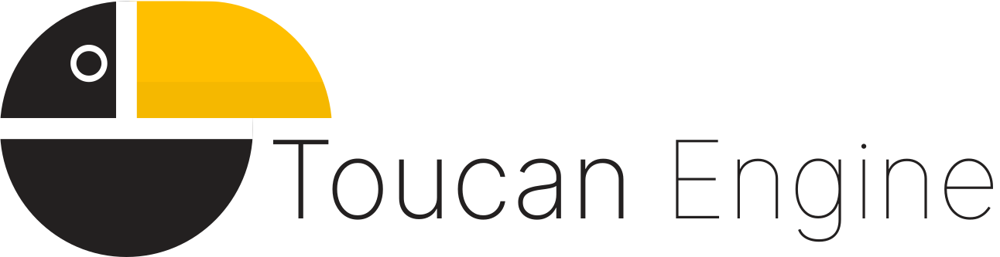

# Toucan Engine

<p align="center">
    
</p>

Toucan Engine is a game engine written in C++ for learning purposes. It is intended to be used as a learning tool for C++ developers that want to learn how to write a game engine. Still a work in progress.

Some features of the engine will use already existing libraries to make the development faster and easier.

## Build
### Prerequisites
* [CMake](https://cmake.org/) -It is the base for generate project files of the engine.
* [Conan](https://conan.io/) - It is used to manage the dependencies of the engine.

### Generate project files
The first step is to generate the project files. Project files are generated by the [CMake](https://cmake.org/) tool. During the generation process, its dependencies are automatically downloaded and installed using [Conan](https://conan.io/). The following command will generate the project files:
#### Unix or Windows:
```bash
mkdir build
cd build
cmake ..
```
